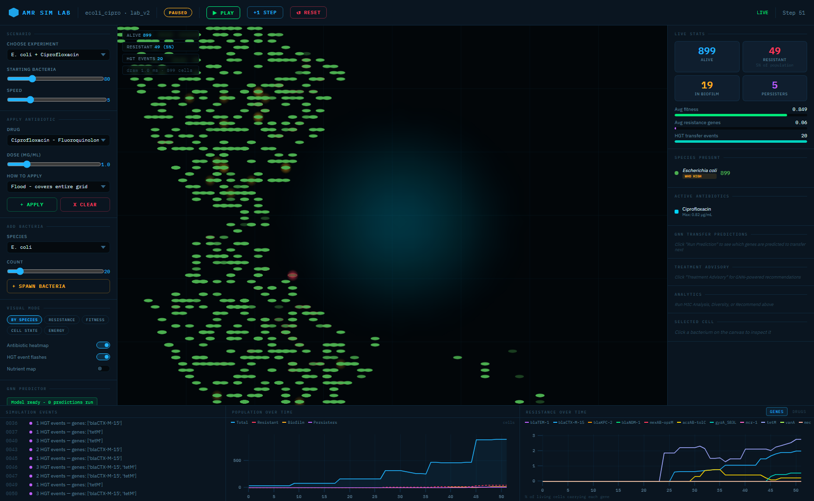
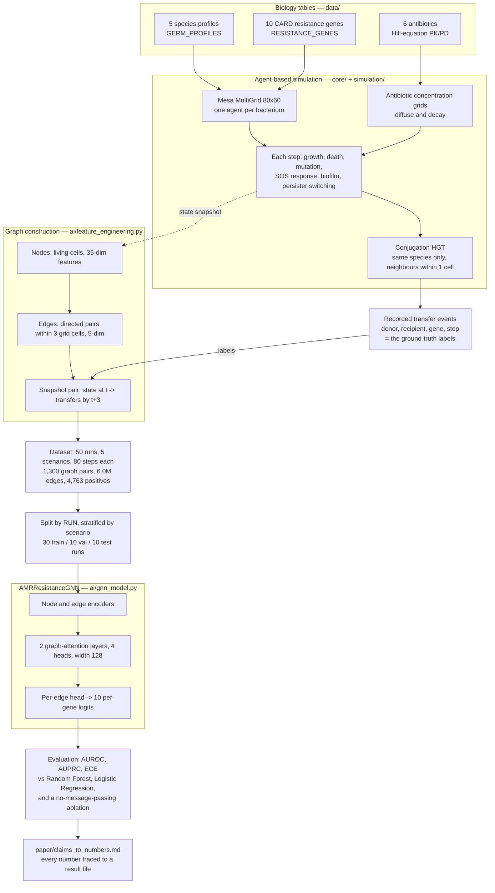
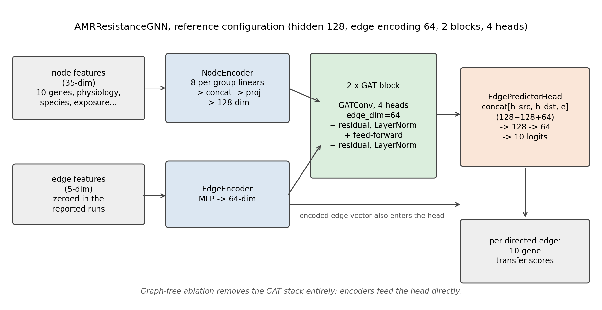
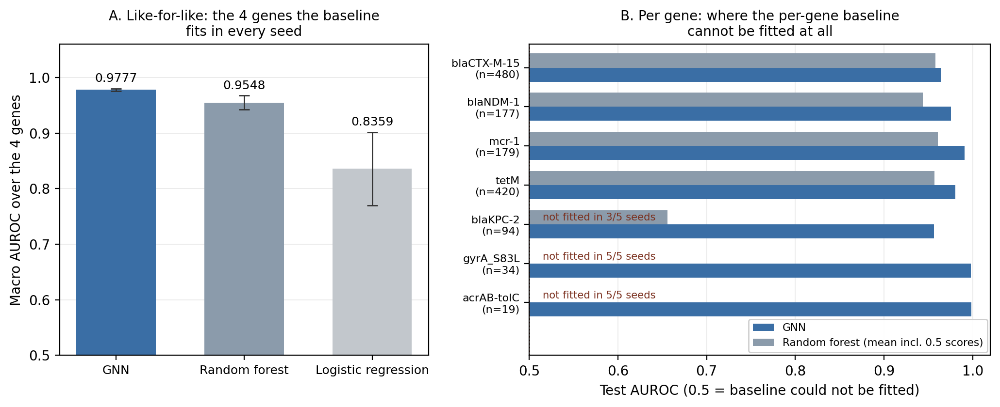
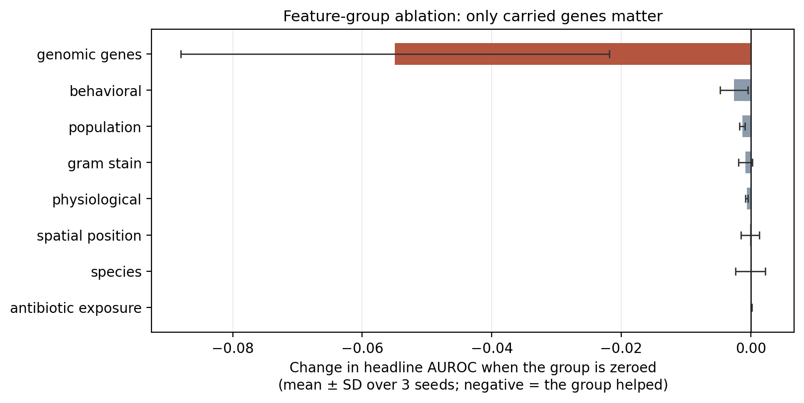
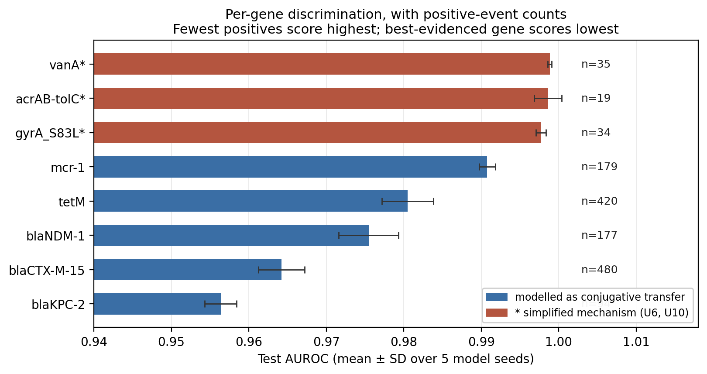

# AMR Simulation Lab 🦠

**Agent-Based Simulation of Antimicrobial Resistance Dynamics**

[-blue?logo=python)](https://python.org)
[](https://mesa.readthedocs.io)
[](https://fastapi.tiangolo.com)
[](https://www.who.int/publications/i/item/WHO-EMP-IAU-2017.12)

A scientifically grounded, interactive agent-based simulation of antimicrobial resistance (AMR) dynamics. Bacteria live, grow, mutate, form biofilms, transfer resistance genes via horizontal gene transfer (HGT), and die — all driven by real resistance mechanisms from the [CARD database](https://card.mcmaster.ca/).

Built as part of a research pipeline targeting **AMR AI for South Asian clinical contexts**, with particular relevance to Pakistan's documented AMR burden (WHO GLASS 2022).

📄 **A paper written on top of this simulator is in [`paper/`](paper/)** — a draft, not submitted, with no external validation. See [Paper](#paper) below.

---

<!-- BEGIN:at-a-glance (generated by paper/make_readme_panel.py) -->
## At a glance

| | |
|---|---|
| **Predicting gene transfer** | Test AUROC **0.9676 ± 0.0076** over 5 model seeds, on held-out *simulation runs* the model never trained on (claim S1) |
| **Against a tuned baseline** | On the 5 genes a per-gene random forest can be fitted to in every seed: GNN **0.9805 ± 0.0021** vs RF **0.9647 ± 0.0031**, GNN ahead on **5 of 5 seeds** (claim S2) |
| **What the graph adds** | **Nothing we can measure.** Message passing moves the headline by **+0.0065 ± 0.0086**, positive in only **3 of 5 seeds** — a spread that includes zero (claim S4) |
| **Calibration** | Expected calibration error **0.0012 ± 0.0003** (claim S6) |
| **Dataset** | **1,300** graph pairs from **50** simulation runs across **5** scenarios — 6,029,316 directed contacts, 4,763 recorded transfer events |
| **Tests** | **280 passing**, including a byte-identity guard on the frozen `paper_v1` biology |

<sub>Generated by [`paper/make_readme_panel.py`](paper/make_readme_panel.py) from
[`ai/checkpoints/reseeded/lab_v2_grouped50_runsplit/results.json`](ai/checkpoints/reseeded/lab_v2_grouped50_runsplit/), which re-checks every
value against [`paper/claims_to_numbers.md`](paper/claims_to_numbers.md) and fails on drift.
These are **within-simulation** results with no external validation — see
[Paper](#paper).</sub>
<!-- END:at-a-glance -->

---

## Demo



*A real capture of the running lab — `ecoli_cipro`, `lab_v2` biology, paused at step 51.
Each dot is a living bacterium; the cyan plume is the ciprofloxacin concentration grid
after a spot dose at the centre; amber halos are biofilm. At this moment 899 cells are
alive, 49 (5%) carry a resistance gene, 19 are in biofilm and 5 have switched to the
persister state, after 20 recorded HGT events. The event log at lower left is the same
stream the paper's labels come from, and the resistance chart tracks each of the 10 genes
separately. Captured headless from `python main.py server`; nothing in the image is mocked
or redrawn.*

---

## Features

### Biological Accuracy
- **5 WHO Priority Pathogens**: E. coli, Klebsiella pneumoniae, Acinetobacter baumannii, Pseudomonas aeruginosa, MRSA
- **6 Antibiotics** with real EUCAST breakpoints: Ciprofloxacin, Meropenem, Colistin, Vancomycin, Ampicillin, Tetracycline
- **10 Resistance Genes** from CARD: blaTEM-1, blaCTX-M-15, blaKPC-2, blaNDM-1, mexAB-oprM, acrAB-tolC, gyrA_S83L, mcr-1, tetM, vanA

### AI/ML Mechanisms
| Mechanism | Real Biology Reference | Implementation |
|-----------|----------------------|----------------|
| SOS Response | Radman 1975; Simmons et al. 2008 | State machine, 8× mutation rate increase |
| Horizontal Gene Transfer | Aine et al. 2018 | Conjugation-based, distance-limited |
| Adaptive Mutation | Eyre-Walker & Keightley 2007 | Gaussian fitness landscape |
| Persister Cells | Lewis 2010, Nat Rev Micro | Stochastic switching, bet-hedging |
| Biofilm Formation | Hoiby et al. 2010 | Density-threshold, 60% protection |
| Chemotaxis | Berg & Brown 1972 | Gradient-based movement |
| PK/PD Killing | Regoes et al. 2004 | Hill equation, MBC/MIC parameters |
| Fitness Landscape | Andersson & Hughes 2010 | Resistance gene cost model |

### Simulation Scenarios
| Scenario | Organisms | Treatment | Clinical Context |
|----------|-----------|-----------|-----------------|
| `validation` | E. coli | None | Growth kinetics baseline |
| `ecoli_cipro` | E. coli | Ciprofloxacin | UTI/sepsis (>70% resistant in Pakistan) |
| `klebsiella_carbapenem` | K. pneumoniae | Meropenem | NDM-1 ICU infections |
| `xdr_acinetobacter` | A. baumannii | Colistin | Last-resort hospital scenario |
| `mrsa_hospital` | MRSA | Vancomycin | Hospital-acquired infection |
| `pakistan_crisis` | E. coli + Klebsiella | Cipro + Meropenem | Pakistan AMR crisis |
| `multi_species` | 3 species | Ciprofloxacin | Ecological competition |

---

## Architecture

**The pipeline, end to end** — from the CARD biology tables to a number in the claims table.
The simulator is the data generator: because it records every transfer as it fires, the
labels are exact, which is the whole reason the learning problem is posable at all.



Two details in that diagram are limitations, not features, and are stated as such in the
paper: HGT is **same-species only** (claim U11), and the edge set is deliberately *wider*
than the transfer radius so the model cannot read eligibility straight off the graph.

```
amr_sim/
├── data/
│   └── card_loader.py          # CARD resistance genes, germ profiles, antibiotic pharmacodynamics
├── core/
│   └── bacterium_agent.py      # Mesa BacteriumAgent — full biology (SOS, HGT, biofilm, mutation)
├── simulation/
│   ├── amr_model.py            # Mesa MultiGrid model — environment, antibiotic diffusion/decay grids, step logic, statistics
│   └── sim_logger.py           # Structured run logging to logs/
├── ai/
│   ├── resistance_analytics.py # MIC estimation, treatment recommendation, population genetics
│   ├── feature_engineering.py  # Simulation state → graph features for the GNN
│   ├── gnn_model.py            # AMRResistanceGNN architecture
│   ├── gnn_trainer.py          # GNN training
│   ├── gnn_inference.py        # GNN inference engine used by the API
│   ├── baselines.py, external_validation.py, threshold_calibration.py,
│   │   gnn_ablation.py, gnn_multiseed.py   # paper evaluation scripts
│   └── checkpoints/            # Trained models and result JSONs
├── api/
│   ├── server.py               # FastAPI: REST commands + WS /ws live state stream + server-side Play
│   └── stream.py               # Stream protocol: snapshot + per-step diff frames, per-client queues
├── frontend/                   # Canvas UI; live via WS /ws, falls back to polling GET /state
│   ├── index.html              # Markup only — no build step; modules attach to window.AMR
│   ├── css/, js/               # Split by concern: rendering, networking, controls, charts
│   └── vendor/                 # uPlot (MIT), vendored
├── tests/
│   ├── test_simulation.py      # Data, agent biology, model dynamics, analytics, science validation, reproducibility
│   ├── test_gnn.py             # GNN feature engineering, model, inference
│   ├── test_api.py             # REST contract tests (FastAPI TestClient) for every endpoint the frontend calls
│   ├── test_stream.py          # WS stream: snapshot+diffs reproduce GET /state; play; resync; events
│   └── test_expected_resistance.py  # EUCAST expected-resistance table + treatment advisory
├── main.py                     # Entry point
└── requirements.txt
```

Antibiotics are not agents: each active drug is a concentration grid on the
model, diffused and decayed every step in `AMRSimulationModel._diffuse_antibiotics()`,
using per-drug `diffusion_rate` / `decay_rate` from `data/card_loader.py`.

---

## Quickstart

### 1. Install dependencies
```bash
git clone https://github.com/M-O-J-U/AMR-Simulation-Lab
cd AMR-Simulation-Lab
pip install -r requirements.txt
```

### 2. Headless run (no server, just terminal output)
```bash
python main.py headless --scenario ecoli_cipro --steps 40 --seed 42
```

### 3. Start the API server, then open the UI
```bash
python main.py server            # http://127.0.0.1:8000 (localhost only)
# then open frontend/index.html in your browser (it is not opened for you);
# pick a scenario in the UI and press Reset.
# Interactive API docs: http://127.0.0.1:8000/docs
```
`--host 0.0.0.0` exposes the server to your local network; it has no
authentication and allows cross-origin requests, so only do that deliberately.

### 4. Run tests
```bash
python main.py test
# or
pytest            # pytest.ini limits collection to tests/
```

### 5. Other commands
```bash
python main.py validate          # 4 quick biology checks
python main.py --help            # train-gnn, baselines, calibrate, ablation-gnn, multiseed, validate-external
```

---

## API Reference

```bash
# Get full state (bacteria positions, heatmaps, stats)
GET  /state

# Advance simulation
POST /step            {"n_steps": 5}

# Apply antibiotic
POST /apply_antibiotic {
  "antibiotic_key": "ciprofloxacin",
  "concentration": 1.5,
  "mode": "uniform",   # uniform | gradient | spot | zone
  "center": [40, 30],  # optional; "spot" only — without it, spot adds no drug
  "radius": 10         # optional; "spot" only
}

# Remove antibiotic (simulate drug clearance)
POST /remove_antibiotic {"antibiotic_key": "ciprofloxacin"}

# Spawn bacteria mid-simulation
POST /spawn_bacteria  {"germ_key": "klebsiella_pneumoniae", "count": 30}

# Reset to scenario
POST /reset           {"scenario": "pakistan_crisis", "initial_bacteria": 100, "seed": 42}   # seed optional

# Server-side Play: resume/pause the step loop, set its rate (1-20)
POST /resume
POST /pause
POST /speed           {"speed": 12}
# POST /step always advances n steps, whether playing or paused.

# GNN transfer prediction and advisory
GET  /gnn/status
POST /gnn/predict     {"threshold": 0.31, "max_nodes": 300, "max_edge_distance": 3}
POST /gnn/advisory    {"available_antibiotics": ["ciprofloxacin", "meropenem"]}

# Population analytics
GET  /analytics/mic?antibiotic_key=ciprofloxacin
GET  /analytics/diversity
GET  /analytics/recommend
```

### Biology versions
`POST /reset` takes `"biology": "lab_v2"` (default) or `"paper_v1"`.
`paper_v1` is the frozen biology that produced the AMRResistanceGNN paper
(byte-identical, enforced by `tests/test_paper_v1_frozen.py`); it is also the
default for `AMRSimulationModel` and the whole training/evaluation pipeline.
`lab_v2` is the corrected biology used by the UI: MRSA carries *mecA* (CARD
ARO:3000617) rather than *tetM*, and cannot acquire the Gram-negative
AcrAB-TolC pump; *K. pneumoniae* no longer starts with blanket `acrAB-tolC`
(0.90 protection vs ciprofloxacin, tetracycline and ampicillin) and instead
follows EUCAST Expected Resistant Phenotypes v1.2 rule 1.7 (ampicillin; the
rule's ticarcillin is not simulated). mecA does not transfer (SCCmec mobilisation is not modelled),
and its fitness cost is configurable in `data/lab_v2_config.json` (0.275: one
measured point from Ender et al. 2004 for a high-resistance lineage, not a
general constant). In `lab_v2`, antibiotic diffusion conserves total drug (in
`paper_v1` it removes 10-70% per step); the per-drug `decay_rate` values are
unchanged and **not validated against real PK/PD** (no cited source, no
defined step duration). Details and sources: `data/biology.py`.

### Live stream: `WS /ws`
Commands stay on REST; the WebSocket only streams state. On connect the
server sends a `snapshot` (the same payload as `GET /state`), then one `diff`
frame per simulation step and per state-changing command: added/removed
cells, changed fields only, stats, new log lines, events (`birth` with
`parent_id`, `death`, `spawn`, `hgt`, `sos_on/off`, `biofilm_on/off`,
`persister_on/off`) and heatmaps (8-bit packed, only when they change).
Frames carry `seq`/`base_seq`; a client that sees a gap sends
`{"type":"resync"}` and gets a fresh snapshot, and a client that falls behind
is resynced automatically. `{"type":"inspect","id":N}` adds that cell's
detail fields (stress, antibiotic damage, offspring count, local density) to
every frame. Full protocol and client apply rules: `api/stream.py`.

The frontend shows `LIVE` when streaming; if the socket drops it shows
`POLLING`, polls `GET /state` every 2.5 s, and reconnects automatically.
Interactive docs: `http://localhost:8000/docs` while the server is running.

---

## Validation Protocol

To confirm the simulation matches real biology:

**Step 1 — Growth validation** (scenario: `validation`)
- Run 50 steps without antibiotics
- Expected: logistic growth curve, doubling ~8–10 steps (E. coli)

**Step 2 — Antibiotic killing** (scenario: `ecoli_cipro`)
- Apply ciprofloxacin at MBC (0.5 µg/mL) at step 15
- Expected: >80% population reduction within 20 steps

**Step 3 — Resistance selection** (same scenario)
- Continue to step 60
- Expected: gyrA_S83L frequency increases; survivors are predominantly resistant

**Step 4 — HGT spread** (scenario: `pakistan_crisis`)
- Watch HGT event log
- Expected: blaCTX-M-15 and blaNDM-1 spread from Klebsiella to E. coli

**Step 5 — Biofilm protection** (scenario: `xdr_acinetobacter`)
- Apply colistin to dense culture
- Expected: biofilm bacteria survive at higher rate than planktonic cells

---

## Data Sources

| Source | Usage |
|--------|-------|
| [CARD v3.2](https://card.mcmaster.ca/download) | Resistance gene ontology, mechanisms, drug class mappings |
| [WHO GLASS 2022](https://www.who.int/publications/i/item/9789240062894) | Pakistan AMR surveillance data, species prevalence |
| [EUCAST 2023 Breakpoints](https://www.eucast.org/clinical_breakpoints/) | MIC susceptible/resistant thresholds for all antibiotics |
| [WHO Priority Pathogens 2017](https://www.who.int/publications/i/item/WHO-EMP-IAU-2017.12) | Pathogen prioritization (CRITICAL/HIGH/MEDIUM) |
| [NCBI AMR Reference](https://www.ncbi.nlm.nih.gov/pathogens/antimicrobial-resistance/) | Gene sequences and nomenclature |

---

## Research Directions

This codebase is the foundation for:

1. **GNN-Based Resistance Prediction** — Graph Neural Network on PATRIC genomic data predicting which resistance genes will emerge given a starting genotype and antibiotic pressure
2. **NDM-1 Spread Modeling** — Calibrate HGT rates to real Pakistan clinical isolate data to produce epidemiologically valid spread curves
3. **Combination Therapy Optimization** — Use the AI analytics engine to find antibiotic combinations that minimize resistance selection
4. **Visual Biomarker Integration** — Link to FaceFuel/TriModal pipeline for clinical presentation prediction from bacterial phenotype imaging

---

## Paper

A write-up of the GNN work built on this simulator lives in [`paper/`](paper/).

> **Status: draft, not submitted. No venue.** Nothing in it is peer reviewed, and it has no
> external validation against real genomic data. Read
> [`paper/claims_to_numbers.md`](paper/claims_to_numbers.md) before quoting any figure from it.

**The document**

| File | What |
|---|---|
| [`paper/amr_hgt_gnn.pdf`](paper/amr_hgt_gnn.pdf) | The assembled paper, 32 pages, 4 figures, 29 references |
| [`paper/amr_hgt_gnn.md`](paper/amr_hgt_gnn.md) / `.html` | Same document, other formats |
| [`paper/draft/`](paper/draft/) | The sections it is built from, `00_abstract.md` … `08_conclusion.md` |
| [`paper/figures/`](paper/figures/) | Figures (PNG + PDF) and their generated captions |

**The four figures**

All generated by [`paper/make_figures.py`](paper/make_figures.py) from the committed result
set; full captions in [`paper/figures/captions.md`](paper/figures/captions.md).



**Architecture.** 35-dim node features and 5-dim edge features through per-group encoders,
two graph-attention blocks (4 heads, width 128), then a head that concatenates both endpoint
representations and emits 10 per-gene logits per directed edge. Edge features are zeroed in
every reported run, so that pathway carries no information.



**GNN vs baselines.** On the five genes a per-gene random forest can be fitted to in every
seed, GNN 0.9805 ± 0.0021 vs RF 0.9647 ± 0.0031, ahead on 5 of 5 seeds (S2). The second
panel shows per-gene scores against held-out positive counts; the dotted line at 0.5 marks
genes the baseline cannot be fitted to at all (S2b).



**Ablation.** Zeroing the carried-gene feature group costs −0.0442 ± 0.0071 AUROC. No other
group is distinguishable from zero, including local antibiotic exposure — under a protocol
where drug is present for only 5 of 80 simulated steps (S5, U4).



**Per-gene discrimination — read the caption before the bars.** Each bar is annotated with
the gene's positive count *in the held-out split*. The two genes with only 5 held-out
positives score **lowest** (acrAB-tolC 0.8890 ± 0.0506, vanA 0.8669 ± 0.0504). Under the
superseded snapshot-level split those same two genes scored 0.9986 and 0.9988 — the highest
in the table. The ordering inverted when the split was corrected, which makes this the
clearest single picture of what that split was doing (S9, U13). The ordering is not a
difficulty ranking over genes: per-gene counts are set by the simulator's seeding code
(U12), not by biology.

**Provenance — the part that matters**

Every number in the paper traces to a committed result file through a script that re-checks it:

| File | What it is for |
|---|---|
| [`paper/claims_to_numbers.md`](paper/claims_to_numbers.md) | Claim → number → source. **S1–S10** are supported; **U1–U14** are claims the numbers do *not* support (U13 is now resolved and kept as the record of what the earlier split cost), each with the reason |
| [`paper/decisions_log.md`](paper/decisions_log.md) | Dated decisions, with the options considered |
| [`paper/citations.md`](paper/citations.md) | Per-reference audit: authors, venue, year, DOI, the text that supports the claim, and how far each source was verified |
| [`paper/gene_mechanism_audit.md`](paper/gene_mechanism_audit.md) | Every modelled gene's real mobility against what the simulator does with it |
| [`paper/STATUS.md`](paper/STATUS.md), [`paper/RESUME.md`](paper/RESUME.md) | What is complete, what is open, and where to pick up |

**Rebuilding it**

```bash
python paper/make_figures.py              # figures + captions, from committed results
python paper/assemble.py                  # -> paper/amr_hgt_gnn.{md,html,pdf}
python paper/make_portfolio.py            # -> portfolio/paper4_portfolio.md
python paper/measure_cross_species_edges.py   # reproduces claim S10
python paper/make_table1.py               # -> paper/table1_genes.tex
```

Each script verifies its numbers against `claims_to_numbers.md` and exits non-zero if they
have drifted. `paper/assemble.py --check` validates citations and figure anchors without
writing. Rendering needs the `markdown` package and Chrome or Edge; neither is in
`requirements.txt`, which pins the environment the *results* were produced on.

A plain-English summary for non-specialists is in
[`portfolio/paper4_portfolio.md`](portfolio/paper4_portfolio.md), including a binding
"do not claim" list.

---

## Citation

If you use this simulation in academic work, please cite:

```bibtex
@software{amr_simulation_2026,
  author    = {Abdul Moiz Muhammad},
  title     = {AMR Simulation Lab: Agent-Based Simulation of Antimicrobial Resistance Dynamics},
  year      = {2026},
  url       = {https://github.com/M-O-J-U/AMR-Simulation-Lab},
  note      = {ORCID: 0009-0006-2795-5271}
}
```

---

## License

No license file is included yet, so no license is granted at this time.

---

## Author

**Abdul Moiz Muhammad**  
BS Artificial Intelligence, COMSATS University Islamabad (2026)  
ORCID: [0009-0006-2795-5271](https://orcid.org/0009-0006-2795-5271)  
GitHub: [github.com/M-O-J-U](https://github.com/M-O-J-U)  
LinkedIn: [linkedin.com/in/abdul-moiz-muhammad](https://linkedin.com/in/abdul-moiz-muhammad)


### Run Sequence
# GPU Run Instructions (historical runbook — does NOT reproduce the paper)

> **These steps predate the paper's current reference set and will not reproduce its
> numbers.** They train on `DEFAULT_CONFIG` (3 data seeds per scenario) with a split taken
> over snapshot pairs. The paper's reference set uses **10 data seeds per scenario (50 runs)
> and a split by simulation run**, because the pair-level split was inflating results — see
> `paper/claims_to_numbers.md` (claim U13) and §4.9 of the paper.
>
> To regenerate the paper's reference set instead, run this as a **single line**
> (PowerShell users: swap the single quotes for double quotes):
>
> ```bash
> python -m ai.reseeded_results --seeds 5 --ablation-seeds 3 --data-seeds 10 --train-frac 0.6 --val-frac 0.2 --split-by run --gnn-hparams '{"hidden_dim":128,"lr":0.001,"n_layers":2}' --rf-hparams '{"n_estimators":300,"max_depth":8}' --no-edge --graph-free --tag grouped50_runsplit
> ```
>
> (~3.5 h on an RTX 4070 SUPER.) The steps below are kept as a record of how the earlier,
> superseded numbers were produced.

Run these on your RTX 4070 machine, in this **exact order**. The order is
not a suggestion — `baselines --full` will now hard-fail (not silently
substitute fake numbers) if `calibrate` and `train-gnn` haven't run first,
because of fixes made this session that removed three separate hardcoded
fabrication paths.

## Prerequisites

```powershell
cd "C:\Users\mojua\Desktop\AMR Simulation Lab"
python main.py test
```
This must show 0 failed before you do anything else (280 passed as of
2026-10-01; it was 114 when these instructions were written, before
`tests/test_api.py` and later GNN and split tests were added). If it doesn't,
something didn't sync correctly from this session's fixes — stop and
re-sync the files, don't proceed to training on a broken pipeline.

## Step 1 — Train the GNN (DEFAULT_CONFIG: 5 scenarios × 3 data seeds × 80 steps, 60 epochs — NOT the paper's config)

```powershell
python main.py train-gnn --full --epochs 60
```

Expected runtime: on CPU here, the same config's smaller cousin (2 seeds,
45 epochs) took the better part of 300+ seconds and didn't fully converge
in one sitting — with your GPU and the full 3-seed dataset, expect
somewhere in the 10-30 minute range depending on how many epochs it
actually takes before early stopping (patience=12) kicks in. Let it run
to completion; don't interrupt it.

This produces:
- `ai/checkpoints/best_model.pt`
- `ai/checkpoints/training_results.json`

**Do not skip this even if you already have a checkpoint from an earlier
session** — that checkpoint was trained on the leaky 36/8-dim features
and buggy labels. It is incompatible with the current 35/5-dim model
architecture and will fail to load or, if it somehow loads, will be
scored against the wrong ground truth.

## Step 2 — Threshold calibration (must run before baselines)

```powershell
python main.py calibrate
```

This loads `best_model.pt` from Step 1, computes per-gene F1-optimal
thresholds, and writes `ai/checkpoints/calibration_results.json`.

Check the printed summary — specifically the "Genes with test-set
positives: X/10" line. If X is less than 6-7, the DEFAULT_CONFIG dataset
may still be too small for some rarer genes (mexAB-oprM, vanA are
expected to show 0 positives — that's correct, they're species-restricted
and shouldn't transfer in these scenarios). If common genes like
blaTEM-1 or acrAB-tolC show 0 positives, something is wrong — stop and
flag it before proceeding.

## Step 3 — Baselines + ablation (requires Steps 1 and 2 to have completed)

```powershell
python main.py baselines --full
```

This will:
1. Re-collect the same DEFAULT_CONFIG simulation data
2. Train Frequency/Logistic Regression/Random Forest baselines
3. Read the GNN's AUROC/AUPRC from `training_results.json` (Step 1) and
   F1/precision/recall from `calibration_results.json` (Step 2) —
   it will **raise an error and refuse to run** if either file is
   missing, rather than substituting a fabricated number. This is
   intentional; do not "fix" this by adding a fallback value.
4. Run the ablation study (feature-group importance)

Produces `ai/checkpoints/baseline_results.json` and
`ai/checkpoints/full_comparison.json`.

**Important — the split-consistency fix**: `split_dataset()` was fixed
this session to use a seeded local RNG (`split_seed`, default 42 from
`DEFAULT_CONFIG`) instead of Python's unseeded global `random` module.
This means Steps 1 and 3, despite being separate process invocations,
will now evaluate the GNN and the baselines against the **same held-out
test set** — this was NOT true before the fix, and silently wasn't true
in earlier sessions' reported numbers either. Do not modify
`split_seed` between steps or the comparison becomes invalid again.

## Step 4 — Verify cross-file consistency (copy-paste this exactly)

```powershell
python -c "
import json
with open('ai/checkpoints/training_results.json') as f: tr = json.load(f)
with open('ai/checkpoints/calibration_results.json') as f: cal = json.load(f)
with open('ai/checkpoints/baseline_results.json') as f: bl = json.load(f)

tr_auroc = tr['test_metrics']['auroc_macro']
bl_auroc = bl['gnn_ours']['auroc_macro']
print('AUROC match:', abs(tr_auroc - bl_auroc) < 1e-9, '|', tr_auroc, 'vs', bl_auroc)

cal_f1 = cal['summary']['macro_f1_at_recommended_threshold']
bl_f1 = bl['gnn_ours']['f1_macro']
print('F1 match:', abs(cal_f1 - bl_f1) < 1e-9, '|', cal_f1, 'vs', bl_f1)
"
```

Both lines must print `True`. If either prints `False`, do not proceed to
writing the paper with these numbers — something in the pipeline broke
between steps and needs to be diagnosed before the numbers can be trusted.

## Step 5 (optional, best-effort) — External validation

```powershell
python main.py validate-external --real
```

This attempts to pull real BV-BRC genomic data for comparison. It may
fail or return inconclusive results — this happened in the prior session
and is a known open limitation, not something you need to force to a
positive result. If it fails, the paper should state this as a limitation
honestly (see prior discussion) rather than being blocked on it.

## What "done" looks like

- `python main.py test` → 0 failed
- Step 4's two `True` checks both pass
- You have four JSON files in `ai/checkpoints/` that all agree with each
  other because they're computed from the same pipeline and the same
  held-out test set — not because any of them were hand-edited to match.

*(Historical note: the sentence that stood here asked for these numbers so a
"resubmission-ready" draft could be written. That is obsolete. The paper was
written, the manuscript it would have been resubmitted to was rejected and
retired, and the current draft has no venue. The numbers it reports come from
the 50-run, run-grouped reference set described at the top of this section,
not from the steps below.)*