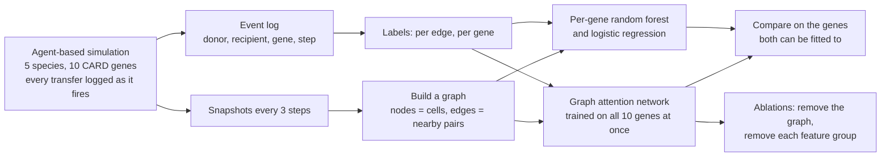

# Predicting per-contact, per-gene horizontal transfer of antimicrobial resistance genes in an agent-based simulation

## Instructions for the website builder

- **Suggested layout, top to bottom:**
  1. Title and one-line pitch.
  2. Status badge (use the `status` field verbatim: this is unpublished work with no venue).
  3. Key-number cards.
  4. The story, in plain English.
  5. Charts: one per spec below.
  6. Method diagram.
  7. What this does not show.
  8. Glossary.
  9. Data provenance.
  10. Contact.
- **Tone:** plain and honest. This project's main interest is that it argues *against* over-reading its own headline number, so do not present it as a breakthrough. No hype words, no superlatives, no claims of priority. The "Do not claim" list at the end is binding.
- **Charts:** draw native, interactive charts from the inline JSON in each spec. Show `error_bars` as error bars. Use each spec's `caption` and `takeaway` as written. The PNG in `fallback_image` is an optional fallback, relative to the repository root.
- **Numbers:** use only the numbers in this file. Do not round further, and do not compute new statistics from them.
- **Health framing:** this is a methods study on simulated data. Do not frame it as a clinical, diagnostic or public-health result, and do not pair it with real-world antimicrobial-resistance death statistics.
- **Code:** the repository is private. Write "Code available on request"; do not link a repository.

## Story

**Problem.** Antibiotic resistance spreads between bacteria by horizontal gene transfer: one cell passes a resistance gene to another, often on a plasmid. Which cell passes which gene to which neighbour is close to impossible to watch directly in a real bacterial community, so there is no straightforward way to train a model to predict it.

**Approach.** I built an agent-based simulation in which every bacterium is an individual agent and every transfer is recorded at the moment it happens. That gives exact labels for a task nobody can label from real observation: given a snapshot of the population, predict for each cell-to-cell contact and each resistance gene whether that gene moves along that contact in the next time window. I trained a graph attention network on it and compared it against per-gene random forests and logistic regression.

**Findings.** The network scored an AUROC of 0.9805 on the five genes the random forest could always be fitted to, against 0.9647 for the forest, ahead in all five runs. That comparison barely moved when I tripled the amount of simulated data and then fixed a flaw in how the data was split, which makes it the result I trust most.

**What surprised me.** Two things. First, almost none of the performance comes from the graph: removing the message passing between cells changes the score by 0.0065 and makes it worse in two runs out of five, so I cannot tell its contribution apart from zero. Removing the list of genes each cell already carries costs 0.0442. The model is mostly reading the two cells' gene contents, not the contact network.

Second, and more useful to anyone building something similar: an earlier version of this work split the data by snapshot rather than by whole simulation run. Snapshots are taken every three simulated steps, so near-identical views of the same bacteria sat on both sides of the split. Re-running everything twice on identical data showed what that was worth — the headline was inflated by 0.0176, but the two rarest genes were inflated by about 0.09, turning scores of 0.999 into 0.87-0.89. The damage landed exactly where it was least visible and most flattering.

**Limitations.** Everything here is inside one simulator, with no validation against real genomes. The simulator only moves genes between cells of the same species, so the cross-species transfers that dominate the real literature are absent from the task entirely. The test set now holds out whole simulation runs, but those runs use the same five scenarios and five species as training, so generalisation to unseen scenarios or species is untested.

**Technical summary.** An agent-based AMR simulation (Mesa, 80x60 grid, 5 species, 10 CARD resistance genes, 6 antibiotics) generated 1300 snapshot pairs over 50 independent runs, comprising 6,029,316 directed contacts and 4,763 recorded transfer events. The held-out split is by simulation run, stratified by scenario. Each snapshot becomes a graph: nodes are cells with 35-dimensional features, edges join cells within three grid cells, and the target is per-edge, per-gene. A graph attention network (2 blocks, 4 heads, hidden 128) reaches a headline macro AUROC of 0.9676 +/- 0.0076 over 5 model seeds, and 0.9805 +/- 0.0021 against 0.9647 +/- 0.0031 for a per-gene random forest on the five genes that baseline fits in every seed. Ablations put the contribution of message passing at 0.0065 +/- 0.0086 (positive in only 3 of 5 seeds) and of carried-gene features at -0.0442 +/- 0.0071. Calibration is good (expected calibration error 0.0012). Labels come from the simulator's own event log rather than from genome differences, and four features that were literal components of the transfer rule were removed as leakage before these numbers were produced.

## Key numbers

- **Headline discrimination:** AUROC 0.9676 +/- 0.0076, averaged over 8 resistance genes, mean and standard deviation across 5 independent training runs.
- **Against the strongest classical baseline:** 0.9805 +/- 0.0021 against 0.9647 +/- 0.0031, on the five genes the random forest can be fitted to in every run. Ahead in 5 runs out of 5. This comparison moved by less than 0.01 across a tripling of the data and a correction to the evaluation, which makes it the most durable number here.
- **Against logistic regression, same five genes:** 0.8590 +/- 0.0248.
- **What the earlier, wrong data split was worth:** 0.0176 AUROC on the headline, and about 0.09 on the two rarest genes, whose scores fell from 0.999 to 0.87-0.89 once whole simulation runs were held out instead of individual snapshots.
- **Contribution of the contact graph:** 0.0065 +/- 0.0086 AUROC, positive in only 3 runs of 5. Not distinguishable from zero.
- **Contribution of the genes each cell already carries:** -0.0442 +/- 0.0071 AUROC when removed — the only feature group that matters. No other group is distinguishable from zero.
- **Genes the per-gene baseline could not be built for at all:** 1 of 10 (acrAB-tolC, 5 events in the held-out split). On an earlier, three-times-smaller dataset this was 3 genes; more data let the baseline fit the others, so this advantage shrinks as data grows.
- **Calibration:** expected calibration error 0.0012 +/- 0.0003.
- **How rare the events are:** 4,763 transfers among 6,029,316 contacts x 10 genes, a positive rate of about 0.000079.
- **How much of the task is cross-species:** 0.107% of contacts, carrying 0 transfers. The simulator only moves genes within a species, so the interspecies case is effectively absent rather than merely rare.
- **Reproducibility:** identical simulated data and training pairs across processes; retraining a seed on a GPU reproduces test AUROC to within 0.0016.

## Charts

### Transfer prediction on the five genes every model can be fitted to

```json
{
  "id": "p4_headline",
  "title": "Transfer prediction on the five genes every model can be fitted to",
  "chart_type": "bar",
  "x_axis": {
    "label": "Model",
    "values": [
      "Graph neural network",
      "Random forest",
      "Logistic regression"
    ]
  },
  "y_axis": {
    "label": "AUROC (higher is better)",
    "min": 0.5,
    "max": 1.0
  },
  "series": [
    {
      "name": "Test AUROC",
      "values": [
        0.9805,
        0.9647,
        0.859
      ],
      "error_bars": [
        0.0021,
        0.0031,
        0.0248
      ]
    }
  ]
}
```

- **caption:** Test AUROC on the five resistance genes that all three models can be trained on in every run (blaCTX-M-15, blaKPC-2, blaNDM-1, mcr-1, tetM). Bars are means over 5 independent training runs; error bars are standard deviations.
- **takeaway:** The graph network is ahead of both classical baselines, in every run. The margin over the random forest is real but modest, about 0.016 AUROC — and it barely moved when the data was tripled and the evaluation corrected.
- **fallback_image:** paper/figures/fig4_model_comparison.png

### Per-gene score against the evidence behind it

```json
{
  "id": "p4_per_gene",
  "title": "Per-gene score against the evidence behind it",
  "chart_type": "bar",
  "x_axis": {
    "label": "Resistance gene",
    "values": [
      "blaNDM-1",
      "tetM",
      "gyrA_S83L",
      "blaCTX-M-15",
      "blaKPC-2",
      "mcr-1",
      "acrAB-tolC",
      "vanA"
    ]
  },
  "y_axis": {
    "label": "AUROC",
    "min": 0.94,
    "max": 1.0
  },
  "series": [
    {
      "name": "Test AUROC",
      "values": [
        0.986,
        0.9844,
        0.9822,
        0.9821,
        0.9761,
        0.9738,
        0.889,
        0.8669
      ],
      "error_bars": [
        0.0054,
        0.001,
        0.0049,
        0.0024,
        0.0045,
        0.0018,
        0.0506,
        0.0504
      ]
    },
    {
      "name": "Transfer events in the dataset (right axis)",
      "axis": "secondary",
      "values": [
        16,
        311,
        24,
        212,
        61,
        217,
        5,
        5
      ]
    }
  ]
}
```

- **caption:** Per-gene test AUROC, highest first, with the number of transfer events each gene actually has in the dataset. Two of these genes (acrAB-tolC, gyrA_S83L) are moved by a deliberately simplified mechanism in the simulator and are labelled as such in the paper; so is vanA.
- **takeaway:** The two lowest-scoring genes, vanA (0.8669) and acrAB-tolC (0.8890), are exactly the two with the fewest transfer events in the held-out split (5 and 5 events), and they carry by far the widest spread across runs. Above that floor the ordering does not track evidence either: blaNDM-1 tops the chart on just 16 held-out events. Under the earlier, flawed split those two rare genes scored near 1.0 and *led* the chart — the ordering inverted once whole simulation runs were held out, which is the clearest single sign of what that split was doing. So this is a chart about sample size and about how the simulator happens to seed genes, not about which real genes are easier to predict. Do not rank genes by it.
- **fallback_image:** paper/figures/fig1_per_gene_auroc.png

### What the model actually uses

```json
{
  "id": "p4_ablation",
  "title": "What the model actually uses",
  "chart_type": "bar",
  "orientation": "horizontal",
  "x_axis": {
    "label": "Feature group removed",
    "values": [
      "genomic genes",
      "species",
      "gram stain",
      "antibiotic exposure",
      "population",
      "behavioral",
      "physiological",
      "spatial position"
    ]
  },
  "y_axis": {
    "label": "Change in AUROC when the group is removed"
  },
  "series": [
    {
      "name": "Change in AUROC",
      "values": [
        -0.0442,
        -0.0046,
        0.0003,
        0.0006,
        0.0016,
        0.0037,
        0.0051,
        0.0052
      ],
      "error_bars": [
        0.0071,
        0.0102,
        0.0091,
        0.0011,
        0.0026,
        0.0017,
        0.0125,
        0.0083
      ]
    }
  ]
}
```

- **caption:** Change in overall AUROC when each group of input features is removed, averaged over 3 runs. More negative means the group mattered more.
- **takeaway:** Only one group matters: the resistance genes each cell already carries. Everything else, including the local antibiotic concentration, changes the score by less than 0.003. Under this dosing protocol the drug is present for only 5 of 80 simulated steps, so the antibiotic result should not be read as a statement about selection pressure in general.
- **fallback_image:** paper/figures/fig3_ablation.png

### How often the per-gene baseline could be built at all

```json
{
  "id": "p4_trainability",
  "title": "How often the per-gene baseline could be built at all",
  "chart_type": "bar",
  "x_axis": {
    "label": "Resistance gene (transfer events in the dataset)",
    "values": [
      "tetM (n=311)",
      "mcr-1 (n=217)",
      "blaCTX-M-15 (n=212)",
      "blaKPC-2 (n=61)",
      "gyrA_S83L (n=24)",
      "blaNDM-1 (n=16)",
      "vanA (n=5)",
      "acrAB-tolC (n=5)"
    ]
  },
  "y_axis": {
    "label": "Runs out of 5 in which the baseline could be fitted",
    "min": 0,
    "max": 5
  },
  "series": [
    {
      "name": "Random forest",
      "values": [
        5,
        5,
        5,
        5,
        3,
        5,
        5,
        0
      ]
    },
    {
      "name": "Graph neural network",
      "values": [
        5,
        5,
        5,
        5,
        5,
        5,
        5,
        5
      ]
    }
  ]
}
```

- **caption:** For each gene, the number of training runs out of 5 in which the per-gene random forest could be fitted. The baseline needs at least five examples of a gene transferring in the sample it draws, and it draws a fresh sample each run, so for rare genes this varies run to run. The jointly trained network produced a prediction in all 5 runs for every gene shown.
- **takeaway:** This is the clearest practical advantage of training one model over all genes rather than one model per gene: for the rarest targets the per-gene approach sometimes cannot be built at all, and for blaKPC-2 it is a coin flip. That matters because the rare genes are often the interesting ones.
- **fallback_image:** paper/figures/fig4_model_comparison.png

## Method diagram



## What this does not show

- **No real-world validation.** Every number is internal to the simulator. An attempt at external validation failed for a data reason: the isolate collections available carried resistance phenotypes rather than per-isolate gene calls, which is what the model predicts over.
- **No cross-species transfer.** The simulator moves genes only between cells of the same species. Real transfer of several of these exact genes is documented across species and genera, so the case of greatest practical interest is absent from the task, the labels and the evaluation alike.
- **The test set is not new simulations.** Snapshots are split individually, so a test snapshot usually comes from a run whose other moments were used in training. This measures generalisation to later moments of familiar runs, not to unseen runs, scenarios or species.
- **Three of eleven genes move by a simplified mechanism.** gyrA_S83L and acrAB-tolC are chromosomal in real bacteria, and vanA spreads between species in reality but only within one species here. Their results describe the learning setup, not resistance biology.
- **Several parameters are invented.** The per-step transfer probabilities, the biofilm multipliers and the dosing protocol are chosen values with no cited source, and no simulated step is assigned a real duration, so no rate can be compared against a measured one.

## Glossary

- **Antimicrobial resistance (AMR):** bacteria surviving drugs that would normally kill them.
- **Horizontal gene transfer (HGT):** one bacterium passing a gene to another living cell, rather than passing it to its offspring. It is how resistance spreads between bacteria that are not related.
- **Conjugation:** the commonest form of horizontal transfer, in which two touching cells are joined and DNA is copied across.
- **Plasmid:** a small circular piece of DNA, separate from the chromosome, that can carry resistance genes and move between cells.
- **Chromosomal gene:** a gene in the cell's main DNA. It is normally inherited by offspring rather than passed sideways, which is why moving certain chromosomal genes in the simulator is flagged as a simplification.
- **Agent-based model:** a simulation where each individual (here, each bacterium) is represented separately and follows its own rules, rather than the population being described by one equation.
- **Graph neural network:** a model over data shaped as points and the links between them. Here the points are bacterial cells and the links are contacts close enough for transfer.
- **Message passing:** the step in which each point in a graph updates itself using information from its neighbours. Removing it turns the model into one that looks only at the two cells at each end of a contact.
- **AUROC:** a score from 0.5 to 1 measuring how well a model ranks true cases above false ones. 0.5 is a coin flip. It is used here instead of accuracy because transfers are so rare that always predicting "no transfer" would be over 99.99% accurate and useless.
- **Calibration (expected calibration error):** whether a model's stated confidence matches how often it is right. Lower is better.
- **Seed / run:** one training run with a different random starting point. Reporting a mean and standard deviation over several runs shows how much the result depends on luck.
- **CARD:** the Comprehensive Antibiotic Resistance Database, the public reference the gene definitions come from.

## Data provenance

Every number traces to one committed results file and to the script that reads it. Paths are inside the private repository.

| Number | Results file | Script |
|---|---|---|
| Headline AUROC, calibration, AUPRC | `ai/checkpoints/reseeded/lab_v2_tuned_noedge_mrsa/results.json` | `paper/make_figures.py` |
| Four-gene comparison, and which genes each baseline could fit | same file, `per_seed[*].per_gene_auroc` | `paper/make_figures.py --rf-coverage` |
| Per-gene AUROC and transfer counts | same file, `per_gene_auroc`, `dataset.positives_per_gene` | `paper/make_figures.py` |
| Feature-group ablation | same file, `ablation` | `paper/make_figures.py` |
| Cross-species share of contacts | regenerated from the committed simulation config | `paper/measure_cross_species_edges.py` |
| Claim-by-claim index of every number | `paper/claims_to_numbers.md` | maintained by hand, checked by the scripts above |
| This file | all of the above | `paper/make_portfolio.py` |

## Do not claim

- Do not say this is published, submitted, under review, or forthcoming. Use the `status` field verbatim: it is a draft with no venue.
- No "first", "novel", "state-of-the-art", "breakthrough" or similar. The paper explicitly declines to claim it identified a previously unstudied problem.
- Do not say the model was validated against real bacteria, real genomes or clinical data. There is no external validation of any kind.
- Do not present any per-gene number as biology. Which genes score well is driven by how many transfer events each gene happened to get, which is set by the simulator's seeding code, not by real gene behaviour.
- Do not say the model predicts transfer between different species. It was never trained or tested on that; the simulator only moves genes within a species.
- Do not say the results show generalisation to new simulations. The test split is by snapshot, not by run.
- Do not describe the simulated transfer of gyrA_S83L, acrAB-tolC or vanA as real conjugation. All three are labelled simplifications.
- Do not say the within-species restriction makes the task easier by adding easy negative examples. That was measured and is false: cross-species contacts are 0.107% of the data.
- Do not quote an AUROC of 0.9934, or any figure from before the leakage fix. Those numbers came from a version that let the model read the answer from its own inputs, and are retired.
- Do not quote "0.9735 versus 0.8950" or "0.9777 versus 0.9548", earlier versions of the headline comparison.
- Do not quote per-gene scores of 0.9986, 0.9977 or 0.9988 for acrAB-tolC, gyrA_S83L or vanA. Those came from a split that leaked near-duplicate snapshots into the test set; the corrected values are 0.8890, 0.9822 and 0.8669.
- Do not say message passing or the graph structure helps. It is positive in only 3 of 5 runs and cannot be distinguished from zero.
- Do not present the rare-gene coverage result as a headline advantage. It now rests on one gene measured from five held-out events, and it shrinks as data grows.
- Do not compare any number here against published results on real genomic data. Different task, different unit of prediction, different data.
- Do not invent or recompute numbers. Use only the values in this file.
- Do not link a code repository. The repository is private; write "Code available on request".
